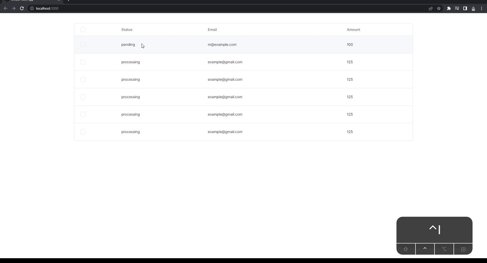

The library am using is from [shadcn/ui](https://github.com/shadcn/ui) Data Table components. Powered by [TanStack](https://github.com/TanStack/table) Table ✨

This is solution is inspired by [chiptus](https://github.com/TanStack/table/discussions/3068#discussioncomment-4245586)

## What component been added :-

- component `CreateSelectColumn.tsx`
- component `IndeterminateCheckbox.tsx`

## 🧞 Commands

```bash
npm run dev
# or
yarn dev
# or
pnpm dev
```

Open [http://localhost:3000](http://localhost:3000) with your browser to see the result.

## 👀 Want to know more about my work?

Feel free to check [Twitter](https://twitter.com/mouktardev) for more works
